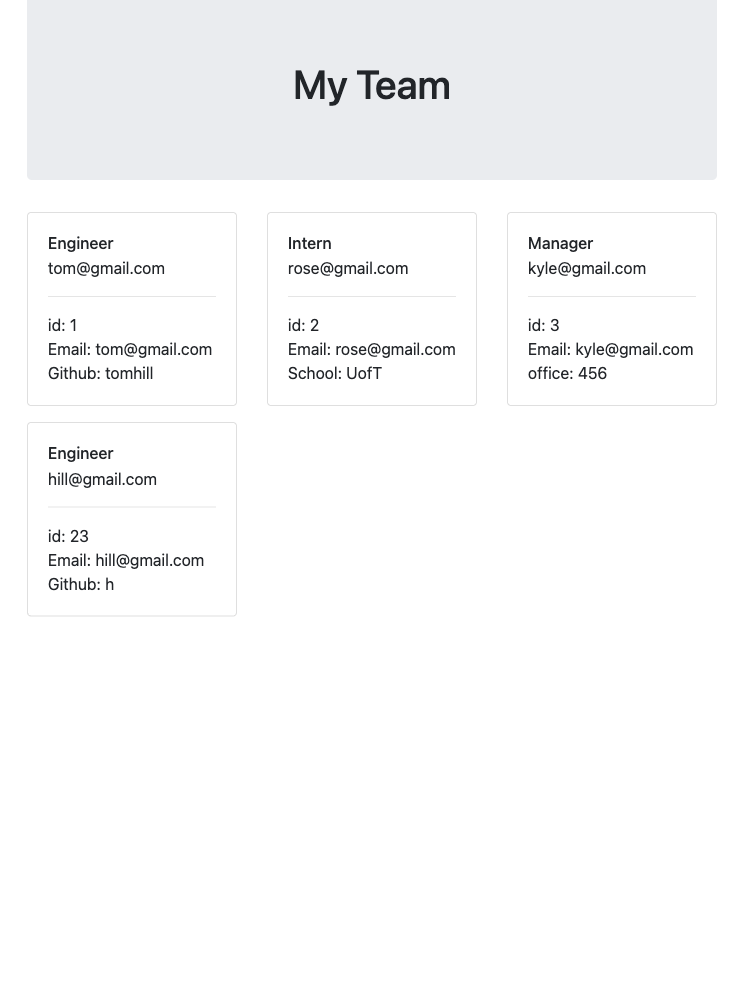

# Object-Oriented Programming Challenge: Team Profile Generator

<!-- PROJECT SHIELDS -->

[![Issues][issues-shield]][issues-url]
[![MIT License][license-shield]][license-url]
[![github][github-shield]][github-url]

<!-- PROJECT LOGO -->
 

  

<h3 align="center">Team Profile Generator</h3>

  

    Using Node.js command-line application that takes in information about employees on a software engineering team and generates an HTML webpage that displays summaries for each person. 
     
    <a href="https://github.com/lavanyavirushan/m10c-team-profile-generator"><strong>Explore the docs »</strong></a>
     
     
    <a href="https://lavanyavirushan.github.io/m10c-team-profile-generator/">View Demo</a>
    ·
    <a href="https://github.com/lavanyavirushan/m10c-team-profile-generator/issues">Report Bug</a>
    ·
    <a href="https://github.com/lavanyavirushan/m10c-team-profile-generator/issues">Request Feature</a>
  

<!-- TABLE OF CONTENTS -->

  
Table of Contents

  <ol>
    <li>
      <a href="#about-the-project">About The Project</a>
    </li>
    <li><a href="#usage">Usage</a></li>
    <li><a href="#license">License</a></li>
    <li><a href="#contact">Contact</a></li>
  </ol>

<!-- ABOUT THE PROJECT -->

## About The Project

A command-line application that accepts user input, in which they can enter information with regards to each team member corresponding to their information. Based on the information entered an HTML file will be generated displaying a formatted team roster.

(<a href="#readme-top">back to top</a>)

<!-- USAGE EXAMPLES -->

## Usage

A manager or business can use this to generate a webpage that displays their team’s basic information in order to have quick access to their email and github profiles.

(<a href="#readme-top">back to top</a>)

<!-- LICENSE -->

## License

See `LICENSE` for more information.

(<a href="#readme-top">back to top</a>)

<!-- CONTACT -->

## Contact

Lavanya Virushan - [@lavanyavirushan](https://github.com/lavanyavirushan)

Project Link: [https://github.com/lavanyavirushan/m10c-team-profile-generator](https://github.com/lavanyavirushan/m10c-team-profile-generator)

(<a href="#readme-top">back to top</a>)

<!-- MARKDOWN LINKS & IMAGES -->

[contributors-shield]: https://img.shields.io/github/contributors/lavanyavirushan/m10c-team-profile-generator.svg?style=for-the-badge
[contributors-url]: https://github.com/lavanyavirushan/m10c-team-profile-generator/graphs/contributors
[issues-shield]: https://img.shields.io/github/issues/lavanyavirushan/m10c-team-profile-generator?style=for-the-badge
[issues-url]: https://github.com/lavanyavirushan/m10c-team-profile-generator/issues
[license-shield]: https://img.shields.io/github/license/lavanyavirushan/m10c-team-profile-generator.svg?style=for-the-badge
[license-url]: https://github.com/lavanyavirushan/m10c-team-profile-generator/blob/main/LICENSE
[github-shield]: https://img.shields.io/badge/-github-black.svg?style=for-the-badge&logo=github&colorB=555
[github-url]: https://github.com/lavanyavirushan/m10c-team-profile-generator
